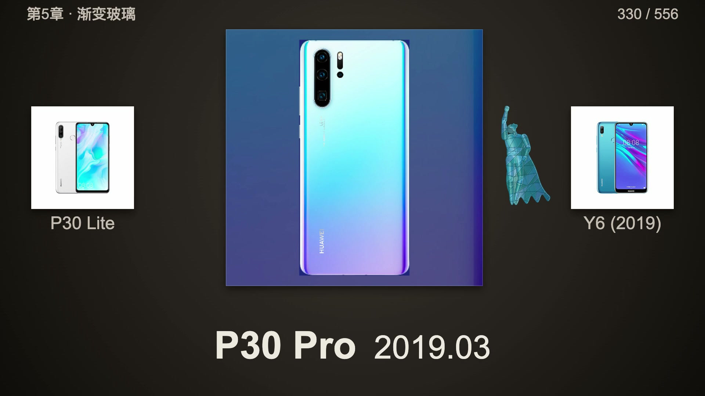

**中文** · [English](README.en.md)

# 华为＋荣耀手机九章游历

一个角色，穿过2004—2026的22年手机设计。**华为＋分家前荣耀历代手机全景，九章重制版。**

[](https://dososo.github.io/huawei-phone-journey/watch.html)

[观看成片](https://dososo.github.io/huawei-phone-journey/watch.html) · [1106条资料目录](https://dososo.github.io/huawei-phone-journey/catalog.html) · [创作技能源码](skills/huawei-phone-journey/SKILL.md)

这是一套可本地运行的网页动画与创作技能。新版完整影片保留原 **451 个华为节点**，按年份与发布月份补入 **105 个分家前荣耀节点**，共 **556 个展示节点**、9章、**11分24.9秒**，1920×1080、原生60fps。资料目录保留 **1106 条记录**。本轮荣耀补采另有48项缺图或身份待核条目，未计入影片。记录可能包含版本、别名、日期推断与待核项；这些数字不代表独立型号全部收齐，也不代表所有图片均为高清或已获再分发授权。

新版成片、九个分章与章节索引通过作品网站与 v2.0.0 Release 提供；仓库同时开放源码、来源索引、时间轴和乐谱事件。完整手机原图库与商业采样库不随源码分发。本地源码预览未导入图片时会明确标注缺图，仍可用于检查角色、布局和时间轴。

## 观看与项目资料

- [作品首页](https://dososo.github.io/huawei-phone-journey/)：作品简介与各入口。
- [九章成片](https://dososo.github.io/huawei-phone-journey/watch.html)：556展示节点、11:24.9、1080p/60fps；支持章节定位、“暂停看清”与分章下载。
- [资料目录](https://dososo.github.io/huawei-phone-journey/catalog.html)：1106条记录，保留来源、日期推断与待核标记。
- [下载新版完整影片](https://github.com/dososo/huawei-phone-journey/releases/download/v2.0.0/huawei-honor-phone-journey-full.mp4) · [新版影片与九个分章](https://github.com/dososo/huawei-phone-journey/releases/tag/v2.0.0) · [原版存档](https://github.com/dososo/huawei-phone-journey/releases/tag/v1.0.0)。

观看和试听无需安装开发环境。公开成品不意味着其中手机图片、音源或商标获得统一再使用许可，详见[素材许可范围](ASSET-LICENSE.md)。

## 这次回应了什么反馈

最初约21分钟的白底横向版本被反馈“太长、眼花、字号小、人物挡手机、漏了荣耀”。新版采用暖石墨柔光、中央固定主台与前后机型、同向短交接；型号和月份放大，重点图延长停留，人物在手机外缘传递材质。原生60fps完整重新渲染，九章配乐重新编排。

片子仍然较长，可以拖进度或按章观看。做它的初衷，是给22年的产品历程做一次周期复盘。从功能机、智能机走到折叠屏，技术底蕴来自几代人的接续努力，也来自持续争取从追赶走向引领。

“全景”表示本版的历代梳理，不表示全球全部独立机型已穷尽；荣耀范围止于分家前。新版已完成本地技术核验和代表画面复看，实际手机舒适度、社媒转码效果与完整听感仍需实际观看。

| 时间 | 年代 | 章节 | 展示节点 |
| --- | --- | --- | --- |
| 00:03 | 2004—2009 | 发端：掌中微光 | 56 |
| 01:08 | 2010—2012 | 启程：智能涌现 | 85 |
| 02:47 | 2013—2015 | 成形：线条与光泽 | 80 |
| 04:23 | 2016—2018 | 开阔：影像视野 | 101 |
| 06:26 | 2019—2020 | 流光：渐变玻璃 | 106 |
| 08:33 | 2021—2022 | 凝聚：金属与双圆 | 29 |
| 09:10 | 2023 | 呼吸：贝母与留白 | 25 |
| 09:44 | 2024—2025 | 展开：折叠与纹理 | 50 |
| 10:46 | 2026 | 归航：当代与远景 | 24 |

## 快速开始

需要 Python 3.9 或更新版本和现代桌面浏览器。先进入技能目录，再检查数据并启动本地页面：

```bash
git clone https://github.com/dososo/huawei-phone-journey.git
cd huawei-phone-journey
cd skills/huawei-phone-journey
python3 scripts/journey.py check
python3 scripts/journey.py serve
```

打开终端显示的本地网址。普通网页由 `src/player.js` 驱动播放时钟，无需安装 npm 依赖。构建导出工程时会排除该时钟，由 GSAP 驱动确定性的逐帧渲染。

在支持本地技能的 AI 工具中，也可将 `skills/huawei-phone-journey` 完整目录复制到其技能目录，再请求“用 huawei-phone-journey 检查资料并打开游历预览”。技能运行不依赖仓库根目录文档。

支持 Skills CLI 的工具可用：`npx skills add dososo/huawei-phone-journey --skill huawei-phone-journey`。

使用你有权使用的图片恢复手机画板。下载和导入另需 Pillow；操作是显式的，可先查看参数：

```bash
python3 -m pip install pillow
python3 scripts/journey.py fetch --help
python3 scripts/journey.py import-images --help
```

下载成功不等于取得版权许可；来源不可访问或身份不明时保留缺图状态。详见[使用与复现](docs/使用与复现.md)和[素材许可范围](ASSET-LICENSE.md)。

需要重演配乐时，再安装音频依赖并查看音源配置入口：

```bash
python3 -m pip install numpy scipy soundfile
python3 scripts/audio.py --help
```

需要通过 HyperFrames 检查或导出时，可在技能目录安装可选依赖：

```bash
npm install
python3 scripts/journey.py build
npm run check
npm run render
```

项目使用 HyperFrames **0.8.139** 与 GSAP **3.14.2**。导出前先实际预览所选素材；检查命令通过不能替代画面和听感验收。

## 能做什么

| 能力 | 实际范围 |
| --- | --- |
| 连续游历 | 九章、556节点、60fps；年月排序与推断标记，固定焦点接力。 |
| 角色变材质 | 共享人体姿态，在画板空间边界内分别绘制媒介表面。 |
| 真实图画板 | 使用用户导入的图片，按完整原幅比例和显示上限绘制；实际构图仍需看图确认。 |
| 资料检索 | 1106 条资料记录及来源线索，入片节点由独立名单确定。 |
| 配乐重演奏 | 从 2427 条乐谱事件与用户自己的音源配置生成音频。 |
| 本地制作 | 网页预览、数据检查、图片导入、静态构建与可选视频导出。 |

人物材质是视觉创作，不是对手机内部材料、屏幕技术或性能的测量。历史来源中的宣布、上市和开售日期语义不同，推断值也不是精确官方发布日期。

## 目录

```text
.
├── README.md
├── README.en.md
├── CONTRIBUTING.md
├── LICENSE
├── NOTICE
├── ASSET-LICENSE.md
├── docs/
│   ├── 设计与原理.md
│   ├── 使用与复现.md
│   └── 新版说明.md
├── site/
│   ├── index.html               作品首页
│   ├── watch.html               完整成片与九章定位
│   ├── edition.json             新版公开媒体与章节索引
│   ├── catalog.html             资料目录
│   └── assets/
│       └── film-preview.jpg      公开影片真实帧预览
├── scripts/
│   ├── build_site.py              成品网站白名单构建
│   └── release_check.py          公开文件与敏感信息检查
├── tests/
│   ├── test_journey.py
│   ├── test_audio.py
│   ├── test_hero.py
│   ├── test_site.py
│   └── test_release_check.py
├── .github/workflows/           持续集成
└── skills/huawei-phone-journey/
    ├── SKILL.md
    ├── index.html
    ├── package.json
    ├── package-lock.json
    ├── hyperframes.json
    ├── src/
    │   ├── hero.js
    │   ├── journey.js
    │   ├── focus.js
    │   ├── app.js
    │   └── player.js             普通网页播放时钟，导出时排除
    ├── data/
    │   ├── catalog.json
    │   ├── timeline.json
    │   └── score.json
    ├── scripts/
    │   ├── journey.py
    │   └── audio.py
    └── examples/
        ├── catalog.json         小型数据示例
        └── audio-bank.json      用户音源配置模板，不含音频
```

技能所需的运行代码和数据都位于技能目录内，可完整复制该目录使用。`site` 保存公开作品页面与成片实帧预览，影片和九个分章作为 Release 附件。个人发布封面与平台文案不随公开项目分发。自行运行产生的图片、音源库、音频和构建目录属于本地文件；不要将私人路径、密钥或未获许可的素材提交到源码仓库。

## 常见问题

**为什么本地预览的手机画板是缺图提示？** 公开成片可直接观看，但用于重建画板的完整手机原图库没有随技能分发。导入可用原图后，本地页面才会显示相应手机；缺图状态用于说明事实，不能作为真实外观交付。

**能否还原已经发布的影片？** 可以重建新版固定焦点布局、九章时间轴和材质传递。公开版本使用独立绘制角色，人物动作细节与成片不同，不承诺原片像素或字节复现。图片、音源、字体、浏览器和导出环境不同都会改变最终结果。

**这是视频模型一键生成的吗？** 主要画面由代码绘制，手机画板来自真实图片；音乐通过乐谱与采样重演奏。AI 可辅助研究和实现，但不能据此称为完全自动生成。

**能否商用或重新发布？** 作者原创代码与文档按木兰宽松许可证第2版使用。手机图片、字体、音源和商标另受其权利条件约束，见[素材许可范围](ASSET-LICENSE.md)。

**能否扩充资料或改成其他产品史？** 可以调整目录、入片名单、时间轴和风格映射。保留精确身份、来源、日期语义和不确定标记，再检查数据与实际渲染。

资料纠错与代码贡献请先阅读[贡献指南](CONTRIBUTING.md)，并附可公开的来源与复现步骤。

## 作者

**爆裂队长 NEXT（BLCaptain）**

- GitHub：[dososo](https://github.com/dososo)
- X：[@thinkszyg](https://x.com/thinkszyg)
- 邮箱：[blteam2026@outlook.com](mailto:blteam2026@outlook.com)

代码与文档采用[木兰宽松许可证第2版](LICENSE)。第三方内容范围见 [NOTICE](NOTICE) 与 [ASSET-LICENSE.md](ASSET-LICENSE.md)。
